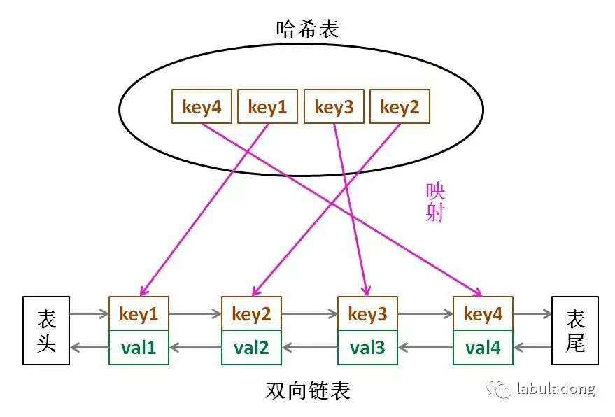

>运用你所掌握的数据结构，设计和实现一个  LRU (最近最少使用) 缓存机制。它应该支持以下操作： 获取数据 get 和 写入数据 put 。
>
>获取数据 get(key) - 如果密钥 (key) 存在于缓存中，则获取密钥的值（总是正数），否则返回 -1。
>写入数据 put(key, value) - 如果密钥不存在，则写入其数据值。当缓存容量达到上限时，它应该在写入新数据之前删除最近最少使用的数据值，从而为新的数据值留出空间。
>
>进阶: 你是否可以在 O(1) 时间复杂度内完成这两种操作？


计算机的缓存容量有限，如果缓存满了就要删除一些内容，给新内容腾位置。但问题是，删除哪些内容呢？我们肯定希望删掉哪些没什么用的缓存，而把有用的数据继续留在缓存里，方便之后继续使用。那么，什么样的数据，我们判定为「有用的」的数据呢？

LRU 缓存淘汰算法就是一种常用策略。LRU 的全称是 Least Recently Used，也就是说我们认为最近使用过的数据应该是是「有用的」，很久都没用过的数据应该是无用的，内存满了就优先删那些很久没用过的数据。


**思路分析：**

1、首先我们需要的是一个有序的数据结构，有队列，向量，链表都可以，另外我们要将常使用的元素放入一端，将不常使用的元素放入另一端，这就需要随机的删除操作，和队首队尾的插入操作，插入这些数据结构都满足O(1)复杂度，但是怎么保证随机删除为O(1)呢？这里只能用链表，而且是双向链表。

2、另外，快速查询操作是原本就必须保证的，所以还需要设计哈希表----map或者unordered_map

**所需要的数据结构已确认，那么两个数据结构该如何组合？**

1、首先可以确认的就是，哈希表中所存储的必须是键值对，而其中的**值必须是指向链表的指针**，为什么？因为能保证链表删除为O(1)复杂度必须是指定要待删除元素的位置指针，如果只是指定待删除元素，那么链表还是需要遍历寻找其位置，复杂度为O(N)，这里存放list的迭代器。

2、其次，链表中存储的是键值对还是值，待确定，肯定不能光存储键啊，要不然值放哪去？还有在链表进行删除的时候，哈希表也需要删除，基于哈希表的unordered_map的删除操作为O(1)复杂度，而基于红黑树的map则为O(logN)，故这里选用的还是unordered_map。

设计思路如下：先考虑链表为键值对



```c++
class LRUCache {
public:
    LRUCache(int capacity) {
        _cap=capacity;
        _size=0;
    }
    
    int get(int key) {
        if(_map.find(key)!=_map.end()){
            //put(key,_map[key]);
            pair<int, int> kv = *_map[key];
            _list.erase(_map[key]);
            _list.push_front(kv);
            _map[key] = _list.begin();
            return kv.second;
        }
        return -1;
    }
    
    void put(int key, int value) {
        if(_map.find(key)!=_map.end()){         //数据已存在
            _list.erase(_map[key]);
            _list.push_front(make_pair(key, value));
            _map[key] = _list.begin();   
        }
        else{
            if(_size>=_cap){
                _map.erase(_list.back().first);
                _list.pop_back();
                --_size;
            }
            _list.push_front(make_pair(key, value));
            _map[key] = _list.begin();    //更新_map
            ++_size;
        }       
    }
private:
    int _cap;
    int _size;
    list<pair<int, int> > _list;
    unordered_map<int, list<pair<int, int> >::iterator> _map;
};
```

根据程序，我们可以list只存储值吗？显然不可以，因为我们要删除什么元素，只能从list中获得，因为只删除list尾部数据，但是list删除后，也得把相应的哈希表删除第掉，如果只存值，那么我们无法得知哈希表中要删除的是什么元素，如下：

```c++
_map.erase(_list.back().first);   //删除哈希表中相对应元素
_list.pop_back();
```

