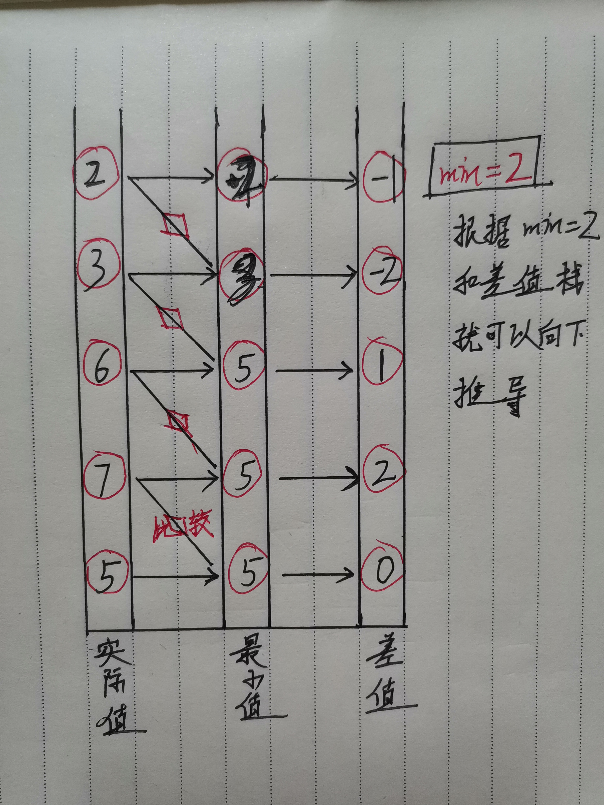

>设计一个支持 push，pop，top 操作，并能在常数时间内检索到最小元素的栈。
>
>push(x) -- 将元素 x 推入栈中。
>pop() -- 删除栈顶的元素。
>top() -- 获取栈顶元素。
>getMin() -- 检索栈中的最小元素。
>
>要求:栈里面存放的都是 int 整数，并且数值的范围是 [-100000, 100000]。要求所有操作的时间复杂度是 O(1)。**如果空间复杂度也能O(1)的话可加分**。

利用辅助栈,时间复杂度为O(1)+空间复杂度为O(N)

```c++
class MyStack{
private:
    stack<int> or_stk;
    stack<int> min_stk;

public:
    void push_nums(int n){
        or_stk.push(n);
        if(min_stk.empty())  min_stk.push(n);
        else{
            int min=min_stk.top();
            if(min>n)  min_stk.push(n);
            else  min_stk.push(min);
        }
    }

    int getMin(){
        return min_stk.top();
    }

    void pop_nums(){
        if(!min_stk.empty() && !or_stk.empty()){
            min_stk.pop();
            or_stk.pop();
        }
    }
};
```

空间复杂度为O(N),如何优化为O(1)?

> **优化思路一:**
>
> 如何从这个数值范围进行突破? 暂时不知,但是我们 可以从栈的特殊性上进行适当优化,如果栈内重复元素过多的话,或者为单调增栈,我们可以对辅助栈进行改进,栈内不仅存储最小值,而且存储最小值个数.这样存储栈的内存会适当减少.但是仍然差的很远,因为这只是特例情况.

> **优化思路二:**
>
> 如何在一个栈内实现两组数据呢? 那就是位运算了,将int型数据拆分成两部分,前16位为目标值,后16位为最小值,然后通过位运算来取值,但是题目限制了取值范围,而16位取值范围为[-2\^15,2\^15-1],即,[-32768,32767],会溢出,如果改为用long类型来,**long所需空间为int的两倍,似乎也不大可行.还没有达到O(1)**

> **最优解思路:**
>
> 现在我们有两个栈，存储了两组数组，那如何并为一组数组就可以实现要求，现在找两组数据之间的关系，这两个数据很显然有关系，最小栈是通过最小值和实际值比较产生的，最小栈里的值要么是之前最小值，要么是当前实际值，这取决与当前值和**前一个最小值**的大小比较，那它就有两个属性：
>
> 1、最小栈内的值来自哪？只要保存比较信息就能知道来自哪，很显然能想到作差，得到差值
>
> 2、值为多少？既然知道来自哪，并且只要记住之前的最小值，根据当前差值，就能推出当前的最小值，而且最小值还在实时更新



```c++
/**时间复杂度和空间复杂度均为O(1)的算法**/
#include<iostream>
#include<vector>
#include<stack>
#include<ctime>
using namespace std;

class getMin{
private:
	int min;
	stack<int> stk;     //存储差值 
	vector<int> vec;    //存储真实的栈内值,用于打印观察 
public:
	void push(int x){   
		if(stk.empty()){
			min=x;
			stk.push(0);
			vec.push_back(x);
		}
		else{
			int compare=x-min;
			stk.push(compare);
			vec.push_back(x);
			min=(x-min<0)?x:min;
		}
	}
	
	void pop(){
		int top=stk.top();
		min=top>0?min:min-top;
		stk.pop();
		vec.pop_back();	
	}	
	int top(){
		int top=stk.top();
		return stk.top()>0?min+top:min;
	}
	int getmin(){
		return min;
	}
	void printstk(){
		for(int i=0;i<vec.size();i++){
			cout<<vec[i]<<" ";
		}
		cout<<endl;
	}
}; 

int main()
{
	getMin stk;
	srand(time(NULL));
	for(int i=0;i<10;i++){       //随机插入值 
		stk.push(rand()%20);
	}
    stk.printstk();              //打印栈内真实值 
    
    for(int i=0;i<10;i++){        
    	cout<<"the top: "<<stk.top()<<"-----";
    	cout<<"the min: "<<stk.getmin()<<endl;
    	stk.pop();
	}
	return 0;
}
```

