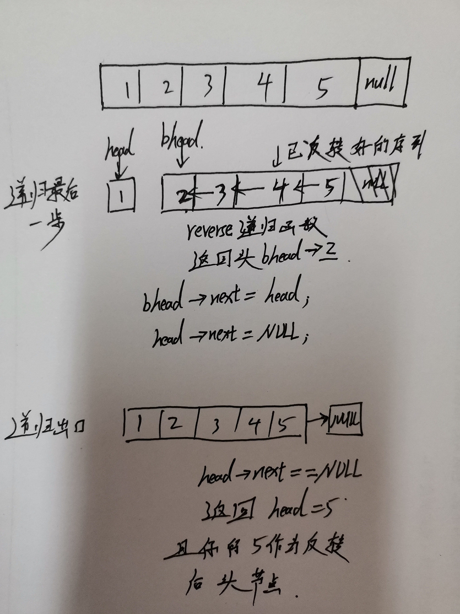

> >反转一个单链表。
> >
> >```
> >示例:
> >
> >输入: 1->2->3->4->5->NULL
> >输出: 5->4->3->2->1->NULL
> >```
> >
> >进阶:
> >你可以迭代或递归地反转链表。你能否用两种方法解决这道题？

先来递归解法：

递归解法一：



```c++
/**
 * Definition for singly-linked list.
 * struct ListNode {
 *     int val;
 *     ListNode *next;
 *     ListNode(int x) : val(x), next(NULL) {}
 * };
 */
class Solution {
public:
    ListNode* pHead;   //保存头结点
    ListNode* reverse(ListNode* head,ListNode* &pHead){
        if(head->next==NULL){ 
            pHead=head;  return head;
        }
        ListNode* ahead=reverse(head->next,pHead);
        
        ahead->next=head;
        head->next=NULL;
        return head;
    }
    
    ListNode* reverseList(ListNode* head) {
        if(head==NULL)  return NULL;
        pHead=new ListNode(0);
        reverse(head,pHead); 
        return pHead;
    }
};
```

递归解法二：思路一样，只是做了简化

```c++
/**
 * Definition for singly-linked list.
 * struct ListNode {
 *     int val;
 *     ListNode *next;
 *     ListNode(int x) : val(x), next(NULL) {}
 * };
 */
class Solution {
public:   
    ListNode* reverseList(ListNode* head) {
        if(head==NULL || head->next==NULL)  return head;
        
        ListNode* pHead=reverseList(head->next);
        head->next->next=head;
        head->next=NULL;
        
        return pHead;
    }
};
```

